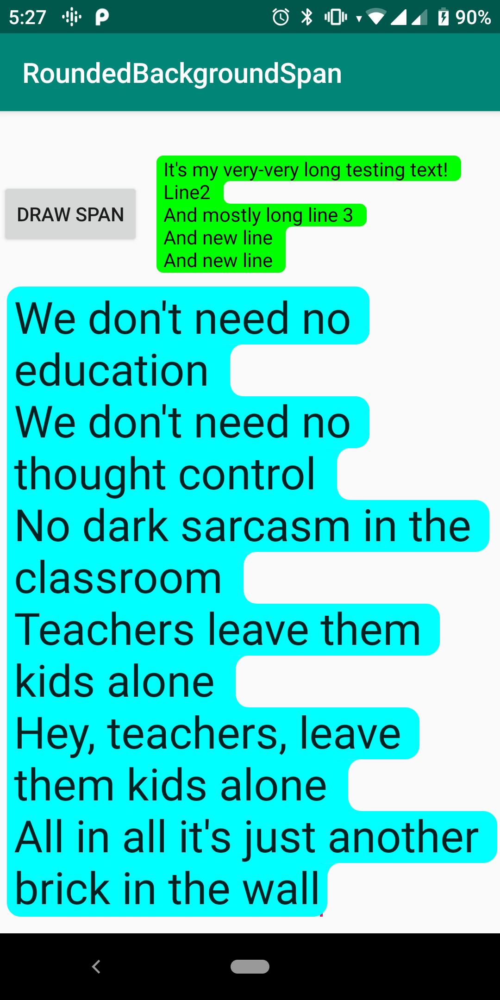

# RoundedBackgroundSpan
It's simple implementation of background span with rounded corners for Android.



## Usage

1. Copy <a href="https://github.com/Semper-Viventem/RoundedBackgroundSpan/blob/master/app/src/main/java/ru/semper_viventem/roundedbackgroundspan/RoundedBackgroundColorSpan.kt">RoundedBackgroundColorSpan</a> in our project.

2. Use it from your code:
``` Kotlin
    private fun initSpannableText() {
        val span = RoundedBackgroundColorSpan(
            backgroundColor = colors.random(),
            padding = dp(5), 
            radius = dp(5)
        )
        
        with(spanText) {
            setShadowLayer(dp(10), 0f, 0f, 0) // it's important for padding working

            text = buildSpannedString { inSpans(span) { append(str) } }
        }
    }
```
